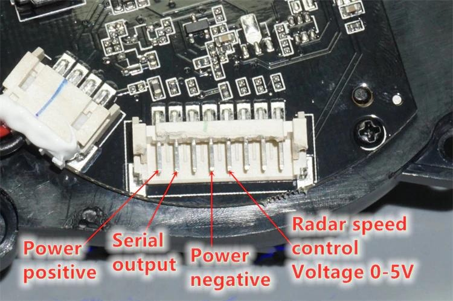

# MB_1R2T 2D LIDAR Demo & Interactive Visualizer

A feature-rich, high-performance Python application for real-time visualization, telemetry monitoring, and protocol analysis of the **MB_1R2T 2D 360-Degree LIDAR Module** (available on AliExpress, ModuStudio, and robotics vendors).

Features an interactive **ROS-compliant TF (Transform) Coordinate Frame (`laser_frame`)**, real-time polar radar grid, distance/intensity heatmap rendering, hover inspection, pan/zoom camera controls, and automatic hardware diagnostics.

---

## Hardware Specifications & Connector Pinout

### 1. PCB Connector Layout & Pinout

Below is the exact 8-pin JST connector pinout as marked on the MB_1R2T PCB:



#### Pinout Mapping Table:

| Pin # | PCB Label / Function | Wire Color (Typical) | Connect to USB-Serial / Power | Description |
| :---: | :--- | :--- | :--- | :--- |
| **1** | **Power Positive** | Red | **5V Power Supply** | Main +5V VCC power (300–500mA supply required) |
| **2** | **Serial Output** | Yellow / Green | **USB Adapter RX Pin** | LIDAR TX output data stream (153600 Baud) |
| **3** | **LIDAR RX** | White | *Unconnected* | LIDAR RX serial input (not required for passive streaming) |
| **4** | **Power Negative** | Black | **GND** | Main Ground (0V reference) |
| **5** | **Radar Speed Control** | Blue / Orange | **GND or 5V or PWM** | Motor speed control voltage input (0 to 5V) |
| **6** | **NC** | - | *Unconnected* | Reserved / No connection |
| **7** | **NC** | - | *Unconnected* | Reserved / No connection |
| **8** | **NC** | - | *Unconnected* | Reserved / No connection |

---

### 2. Motor Speed & Resolution Control (Pin 5)

The rotation speed and sampling resolution can be adjusted by changing the voltage or PWM on **Pin 5 (Radar Speed Control)**:

| Mode | Pin 5 Connection | Rotation Speed | Angular Resolution / Points per 360° |
| :--- | :--- | :---: | :---: |
| **Max Rotation Speed** | Connect **Pin 5 to GND** (0V) | **~9.0 Hz** (~540 RPM) | **~200 measurements / rotation** |
| **Min Rotation Speed** | Connect **Pin 5 to 5V** (5V) | **~3.7 Hz** (~222 RPM) | **~1024 measurements / rotation** |
| **Custom Speed** | 0–5V PWM Signal | 3.7 Hz to 9.0 Hz | Variable (200 to 1024 pts/rot) |

> [!IMPORTANT]
> **Motor Enable Notice:** The optical sensor will **NOT** send data unless the motor is spinning. Ensure Pin 5 is connected to GND or 5V (or a PWM source).

---

### 3. Serial Communication Parameters
- **Baud Rate**: `153600` bps (6.51 µs bit period)
- **Data Bits**: `8`
- **Parity**: `None`
- **Stop Bits**: `1`
- **Byte Order**: `LSB First` (Little-Endian)

---

## Data Packet Protocol Specification

The MB_1R2T LIDAR transmits continuous binary packets. Each data packet is structured as follows:

| Field Index | Byte(s) | Value / Type | Field Description |
| :---: | :---: | :---: | :--- |
| **1** | `0x00 - 0x01` | `0xAA 0x55` | **Header Sync Bytes** (Marks packet start) |
| **2** | `0x02` | `0x38` (or `0x28`, `0x3C`) | **LIDAR / Firmware Type ID** (Displayed in Telemetry HUD) |
| **3** | `0x03` | `0x28` (40 dec) | **Point Count ($N$)** in packet (e.g. 40 points per packet) |
| **4** | `0x04 - 0x05` | 2 Bytes (LSB First) | **Starting Angle** ($A_{\text{start}}$, raw range: `0x0000` to `0xB400`) |
| **5** | `0x06 - 0x07` | 2 Bytes (LSB First) | **Ending Angle** ($A_{\text{end}}$, raw range: `0x0000` to `0xB400`) |
| **6** | `0x08 - 0x09` | 2 Bytes (`0x00 0x00`) | **Reserved / Checksum Header** |
| **7** | `0x0A +` | $N \times 3$ Bytes | **Measurement Data** ($N$ points $\times$ 3 bytes per point) |

### Sample Point Format (3 Bytes per Point):
- **Byte 0**: Signal Reflection Quality / Intensity ($0$ to $255$)
- **Byte 1**: Distance LSB
- **Byte 2**: Distance MSB

### Distance & Angle Decoding Formulas:
```python
# Raw Distance (0.25mm units) converted to meters:
distance_meters = ((Distance_MSB << 8) | Distance_LSB) / 4000.0

# Interpolated Angle per sample (i = 0 to N-1):
angle_raw = (Start_Angle + (Step_Angle * i)) % 0xB400
angle_radians = (angle_raw / 0xB400) * (2 * math.pi)

# ROS TF Cartesian Coordinates:
world_x = math.cos(angle_radians) * distance_meters  # +X Forward
world_y = math.sin(angle_radians) * distance_meters  # +Y Left
```

---

## Deployment Guide from Scratch (Any OS)

###  macOS Deployment
```bash
# Clone repository
git clone https://github.com/Vidicon/mb_1r2t_ros.git MB_1R2T_LIDAR_Demo
cd MB_1R2T_LIDAR_Demo

# Setup Virtual Environment
python3 -m venv .venv
source .venv/bin/activate
pip install pyserial pygame-ce

# Find connected serial port
ls /dev/cu.usbserial*

# Run visualizer
python mb_1r2t.py
```

### 🐧 Linux Deployment (Ubuntu / Debian / Raspberry Pi OS)
```bash
# Install dependencies
sudo apt update && sudo apt install -y python3 python3-venv git
sudo usermod -aG dialout $USER

# Setup project
git clone https://github.com/Vidicon/mb_1r2t_ros.git MB_1R2T_LIDAR_Demo
cd MB_1R2T_LIDAR_Demo
python3 -m venv .venv
source .venv/bin/activate
pip install pyserial pygame-ce

# Identify USB port and run
ls /dev/ttyUSB*
python mb_1r2t.py
```

### 🪟 Windows 10 / 11 Deployment
Open PowerShell:
```powershell
cd C:\path\to\MB_1R2T_LIDAR_Demo
python -m venv .venv
.\.venv\Scripts\Activate.ps1
pip install pyserial pygame-ce
python mb_1r2t.py
```

---

## Interactive Controls Reference

| Input / Shortcut | Action | Description |
| :---: | :--- | :--- |
| **Mouse Wheel** | **Zoom In / Out** | Adjusts view scale (5 to 2000 px/m) |
| **Left Click + Drag** | **Pan Viewport** | Moves camera center across workspace |
| **Hover Mouse** | **Point Inspection** | Displays X, Y (m), distance, angle, and intensity |
| **`[R]`** | **Reset View** | Resets pan and zoom to origin |
| **`[C]`** | **Cycle Color Mode** | Cycles Distance Heatmap, Intensity, Neon Cyan |
| **`[G]`** | **Toggle Grid** | Shows/hides polar rays & concentric rings |
| **`[T]`** | **Toggle TF Axis** | Shows/hides $+X$ Forward and $+Y$ Left TF frame |
| **`[S]`** | **Toggle Sweep** | Shows/hides live rotating laser ray |
| **`[SPACE]` / `[P]`** | **Pause / Resume** | Freezes current point cloud frame |
| **`[H]`** | **Toggle HUD** | Shows/hides telemetry HUD panels |

---

## Acknowledggements & Technical References

- **STM32 Protocol Research**: Special thanks to [pav2000/LidarStm32f103](https://github.com/pav2000/LidarStm32f103) for STM32 microcontroller driver analysis and MB_1R2T packet protocol reverse-engineering.
- **Base ROS Package**: Inspired by [Vidicon/mb_1r2t_ros](https://github.com/Vidicon/mb_1r2t_ros).
- **Visualization Engine**: Pygame-CE (Community Edition).
